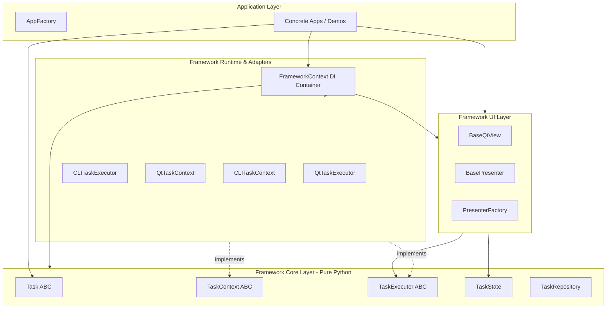
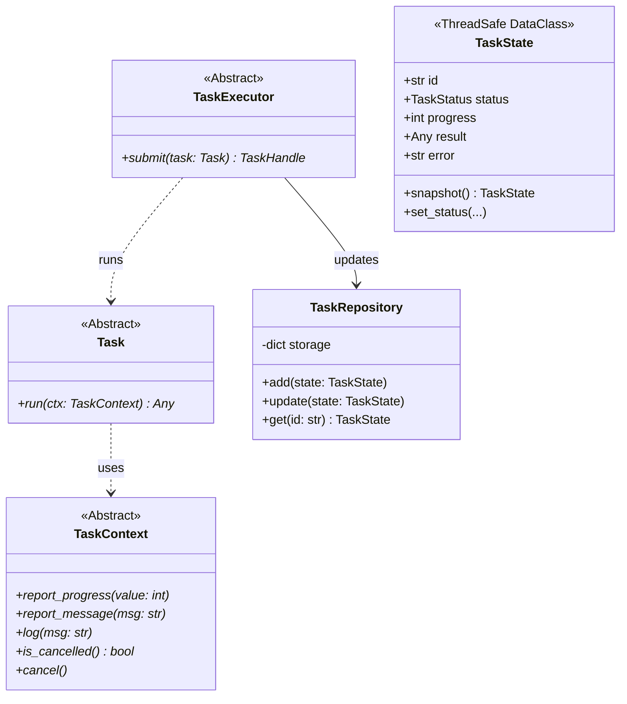
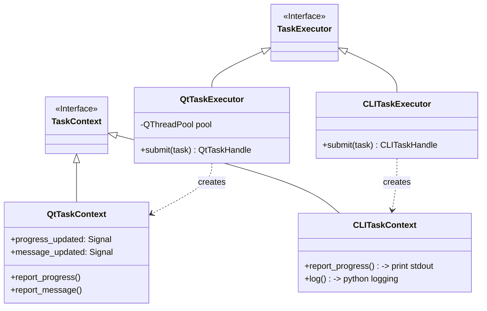
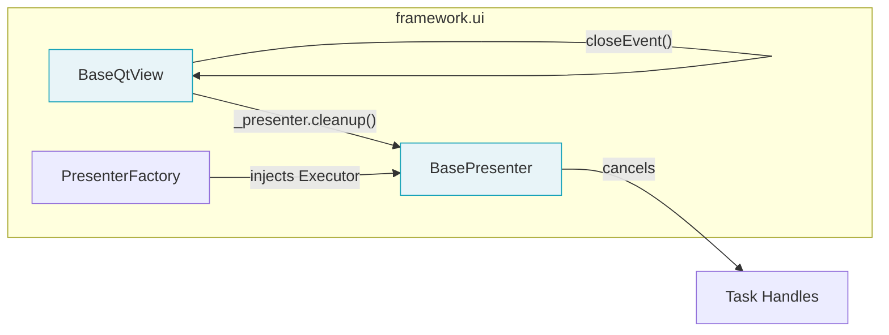
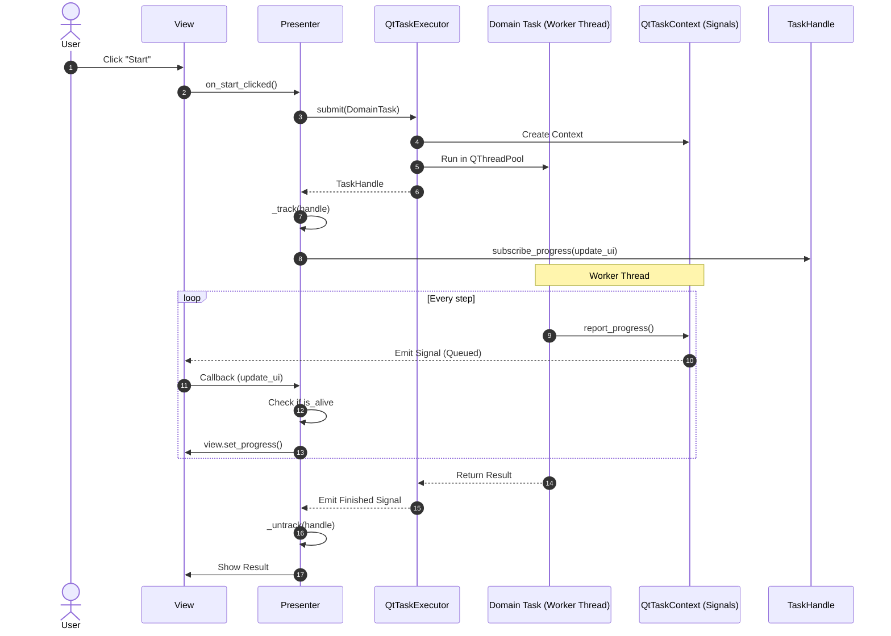
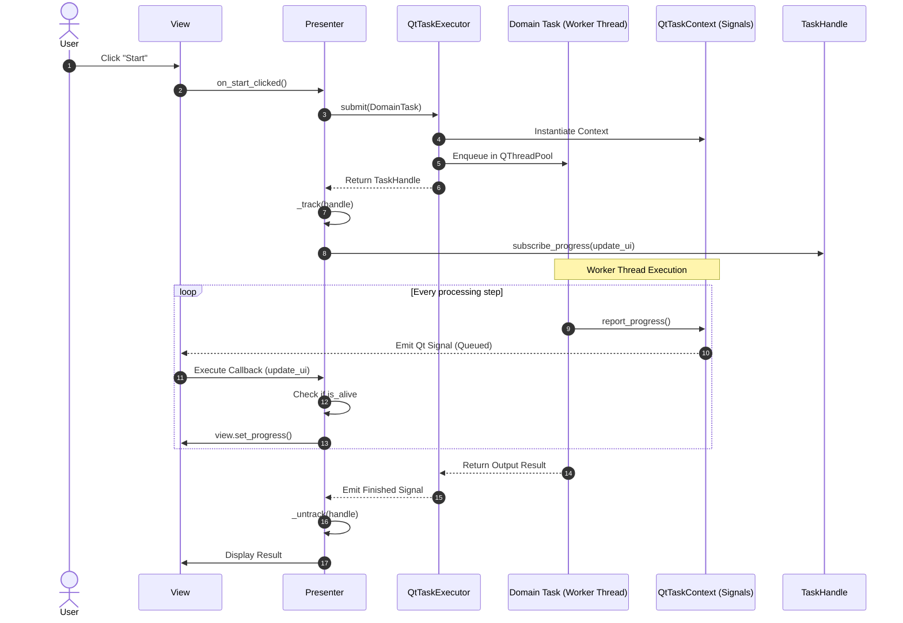
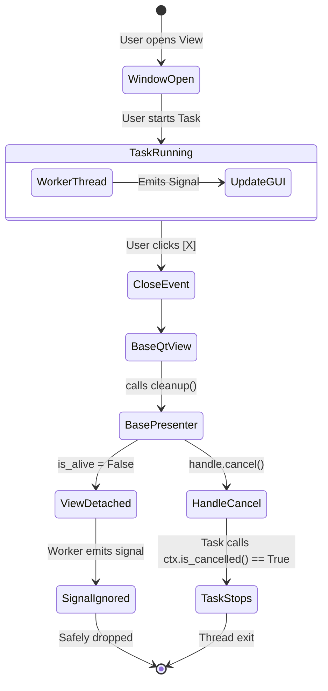

# Task-Oriented UI Framework — Architecture Master Document

This document details the overall architecture and the design of each module within the **Task-Oriented UI Framework**. The framework is designed strictly following **Clean Architecture** principles, achieving a complete separation of concerns between Business Logic (Domain/Task) and the User Interface (UI) through interfaces and a lightweight DI Container.

---

## 1. Overall Architecture

The framework applies a clear layered architectural model, ensuring the Dependency Inversion principle. The UI layer depends on the Core, and the Core is completely agnostic of the UI or any external libraries (including Qt).



---

## 2. Module Specifications

### 2.1. Module `framework.core`
The heart of the Framework. It is 100% Pure Python, completely independent of PyQt/PySide or the underlying OS.



**Key Components:**
*   **`Task`**: Defines a specific unit of work. All business logic resides in the `run(ctx)` method.
*   **`TaskContext`**: Provides a safe communication channel for the Task to report progress, log info, or check the `cancel` flag without knowing whether it is running in a CLI or GUI environment.
*   **`TaskState`**: Stores the execution state of a Task. It contains an internal `threading.Lock` to ensure thread-safety when the Worker thread updates the state and the GUI thread reads it via the `snapshot()` method.

### 2.2. Modules `framework.runtime` & `framework.adapters`
The bridge (Adapters) that allows the Core to run in specific environments (Qt GUI or Command Line).



*   **`QtTaskExecutor`**: Manages the `QThreadPool`. When it receives a `Task`, it wraps it in a `QRunnable` and executes it on a background worker thread.
*   **`QtTaskContext`**: Defines Qt Signals (`progress_updated`, `finished`, etc.). Any calls from the Task (on the Worker Thread) emit Signals safely routed to the GUI Thread (via Qt's Queued Connections).
*   **`CLITaskExecutor / CLITaskContext`**: A synchronous execution environment allowing developers to test Tasks via the Terminal instantly without launching a GUI.

### 2.3. Module `framework.ui` (View & Presenter Contracts)
Provides mandatory Base classes to standardize the UI flow and prevent memory leaks (Zombie Tasks).



*   **`BaseQtView`**: Inherits from `QWidget`. Overrides `closeEvent()` to automatically call `presenter.cleanup()` when the window is closed.
*   **`BasePresenter`**:
    *   Owns the safety guard `self.is_alive`. Any callback returning from a Thread to the UI **MUST** check `if not self.is_alive: return` to prevent `NoneType` crashes.
    *   Tracks all running Tasks via the `_handles` list.
    *   The `cleanup()` method automatically cascades the cancel signal to all active Tasks when the View is destroyed.

### 2.4. Module `framework.bootstrap` (Single Point of Wiring)
Acts as the DI (Dependency Injection) Container where all Framework dependencies are initialized and connected.

*   **`FrameworkContext`**: A highly lightweight DI Container. Provides a fluent API (`register()`, `wire()`) so that the `run()` method of any Application only requires exactly 3 lines of code to set up a complex configuration.

---

## 3. Application Startup Sequence

The following sequence diagram illustrates the lifecycle from launching the `main.py` entry point to fully displaying a wired Application View.



---

## 4. Standard Task Lifecycle

When a User clicks the "Run" button on the UI, the event flow occurs as follows:



---

## 5. Anti-Zombie / Self-Cleanup Mechanism

One of the most critical issues in UI applications is when a User closes a window while a background Task is still running. The framework completely resolves this through the following mechanism:



---

## 6. Guidelines for Developers & AI

1.  **Test Location (`framework/tests`)**: Never write Unit Tests for GUI logic. Tests must strictly cover the Core, Executor, Context, and Base Presenter components within the `framework/tests` directory.
2.  **View Inheritance**: Every View MUST inherit from `framework.ui.views.BaseQtView`. Do not inherit from `QWidget` directly.
3.  **Presenter Inheritance**: Every Presenter MUST inherit from `framework.ui.presenters.BasePresenter`. The very first line of the overridden `bind()` method MUST be `super().bind(view)`.
4.  **The `is_alive` Guard**: Any Presenter method executed as a Callback (e.g., `on_progress`, `on_finished`) MUST begin with the safety guard:
    ```python
    if not self.is_alive:
        return
    ```
5.  **Bootstrap Exclusivity**: Always use `FrameworkContext` for initialization. Never manually instantiate `TaskExecutor` or `TaskRepository` outside of the `framework/bootstrap.py` file.

*This document serves as the "Source of Truth" for the entire UI Framework Architecture.*
