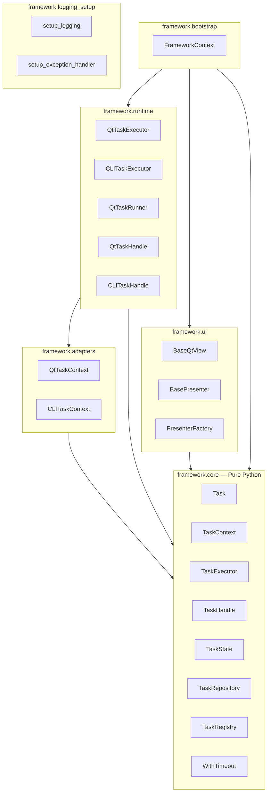

# SDD Index — Task-Oriented UI Framework

This directory contains the **Software Detail Design (SDD)** documents for every module in the `framework/` package. Each file covers the internal structure, component specifications, class/sequence diagrams, and testing notes for its module.

---

## Document Map

| File | Module | Key Components |
|---|---|---|
| [SDD_core.md](./SDD_core.md) | `framework.core` | Task, TaskContext, TaskState, TaskExecutor, TaskHandle, TaskRepository, TaskRegistry, WithTimeout |
| [SDD_adapters.md](./SDD_adapters.md) | `framework.adapters` | QtTaskContext, QtTaskSignals, CLITaskContext |
| [SDD_runtime.md](./SDD_runtime.md) | `framework.runtime` | QtTaskExecutor, QtTaskRunner, QtTaskHandle, CLITaskExecutor, CLITaskHandle |
| [SDD_ui.md](./SDD_ui.md) | `framework.ui` | BaseQtView, BasePresenter, PresenterFactory |
| [SDD_bootstrap.md](./SDD_bootstrap.md) | `framework.bootstrap` | FrameworkContext (DI Container) |
| [SDD_logging.md](./SDD_logging.md) | `framework.logging_setup` | setup_logging(), setup_exception_handler() |

---

## Module Dependency Graph

---

## Layer Rules

| Layer | Can import | Cannot import |
|---|---|---|
| `core` | Python stdlib only | Qt, adapters, runtime, ui, bootstrap |
| `adapters` | `core`, PySide6 (Qt only), stdlib | `runtime`, `ui`, `bootstrap` |
| `runtime` | `core`, `adapters`, stdlib | `ui`, `bootstrap` |
| `ui` | `core`, PySide6, stdlib | `adapters`, `runtime`, `bootstrap` |
| `bootstrap` | `core`, `runtime`, `ui` | `app` layer |
| `app/*` | All of the above | Other `app` sub-packages |
