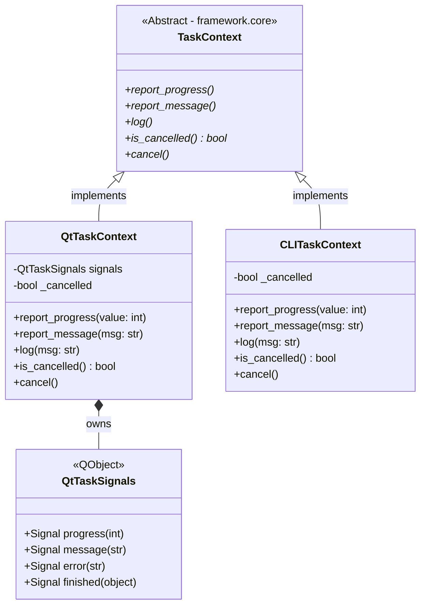
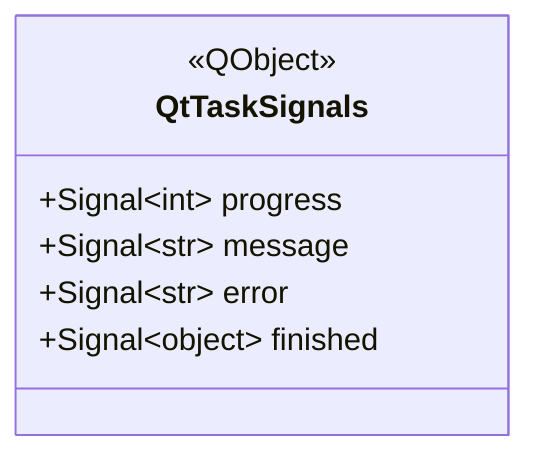
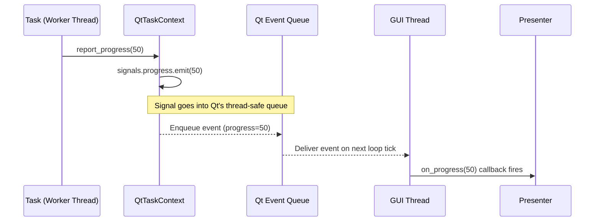
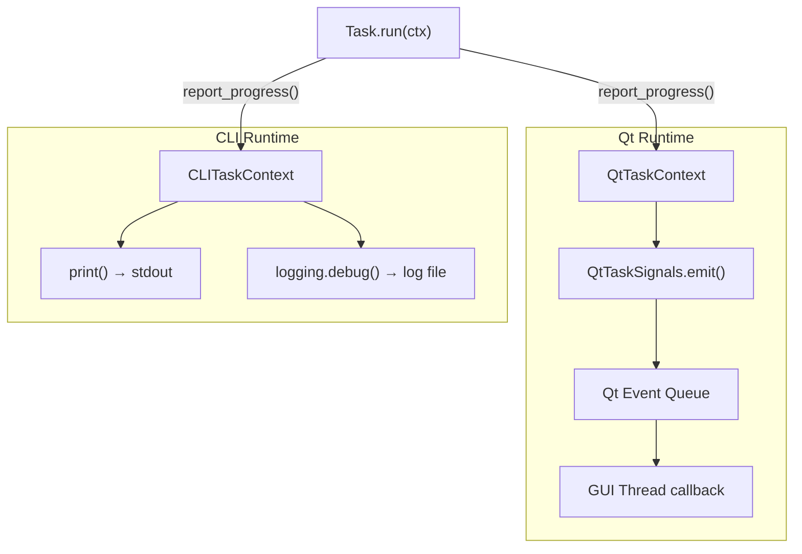

# SDD — Module `framework.adapters`

**Module:** `framework/adapters/`
**Sub-modules:** `adapters/qt/`, `adapters/cli/`
**Type:** Runtime Adapter Layer
**Dependencies:** `framework.core`, PySide6 (Qt adapter only), Python `logging`

---

## 1. Responsibility

This module provides concrete implementations of `TaskContext` for each supported runtime. It is the bridge between the pure domain (`Task`) and the hosting environment (Qt GUI or CLI terminal). The domain never imports this module — dependency only flows inward.

---

## 2. Module Class Diagram

---

## 3. Component Specifications

### 3.1 `adapters/qt/qt_context.py` — `QtTaskContext`

**File:** `framework/adapters/qt/qt_context.py`

The Qt runtime adapter for `TaskContext`. When a Task (running on a Worker Thread) calls any reporting method, this class emits a Qt Signal. Qt's event system automatically delivers the signal to the GUI Thread via a **Queued Connection** — guaranteeing thread safety without any manual lock.

#### `QtTaskSignals` (QObject)

The `QObject` inheritance is mandatory. Qt Signals can only be defined on `QObject` subclasses, and the queued connection mechanism (cross-thread dispatch) requires the signal owner to live within Qt's object system.

#### Signal Dispatch Flow

#### Method Routing Table

| TaskContext Method | Qt Implementation | Thread |
|---|---|---|
| `report_progress(v)` | `signals.progress.emit(v)` | Worker → GUI via queue |
| `report_message(m)` | `signals.message.emit(m)` | Worker → GUI via queue |
| `log(m)` | `signals.message.emit("[LOG] " + m)` | Worker → GUI via queue |
| `is_cancelled()` | `return self._cancelled` | Worker Thread read |
| `cancel()` | `self._cancelled = True` | GUI Thread write |

**Design note on `log()`:** Currently routes to the message signal so the UI can optionally display diagnostic output. Future improvement: route to Python `logging` module instead to separate diagnostics from UI messages.

---

### 3.2 `adapters/cli/cli_context.py` — `CLITaskContext`

**File:** `framework/adapters/cli/cli_context.py`

The CLI runtime adapter for `TaskContext`. All output is synchronous — there is no thread dispatch because the CLI executor runs tasks on the calling thread.

#### Method Routing Table

| TaskContext Method | CLI Implementation | Output |
|---|---|---|
| `report_progress(v)` | `print(f"[PROGRESS] {v}%")` | stdout |
| `report_message(m)` | `print(f"[INFO] {m}")` | stdout |
| `log(m)` | `_logger.debug(m)` | Python logging (NOT stdout) |
| `is_cancelled()` | `return self._cancelled` | in-memory flag |
| `cancel()` | `self._cancelled = True` | in-memory flag |

**Critical distinction:** `log()` routes to `logging.debug()` while `report_message()` routes to `print()`. This separation ensures:
- Debug diagnostics are controllable via log level configuration.
- User-visible status messages always appear on stdout.
- The two channels never mix output.

---

## 4. Runtime Comparison

---

## 5. Extension Point

To add a new runtime adapter (e.g., WebSocket or gRPC):

1. Create `framework/adapters/ws/ws_context.py`.
2. Implement all 5 abstract methods of `TaskContext`.
3. Create the matching executor in `framework/runtime/ws_executor.py`.
4. Add `FrameworkContext.ws()` classmethod in `framework/bootstrap.py`.

No changes to any existing file are required.

---

## 6. Testing Notes

| Component | Test approach |
|---|---|
| `CLITaskContext` | Instantiate directly; call all methods; assert `_cancelled` flag |
| `QtTaskContext` | Requires `QApplication`; use `pytest-qt`; assert signal emissions |
| Signal delivery | Integration test: submit task via `QtTaskExecutor`, verify callback fires |
