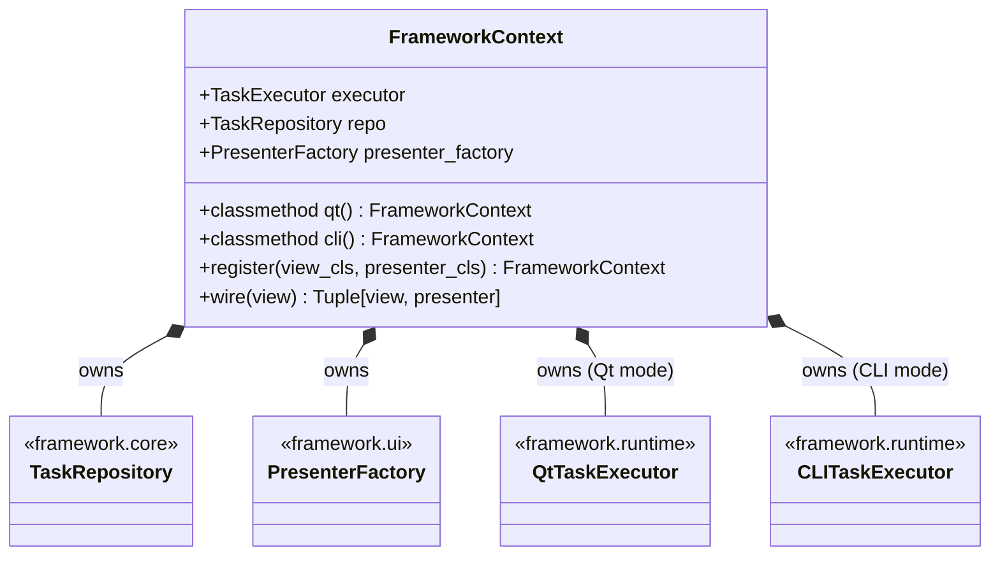
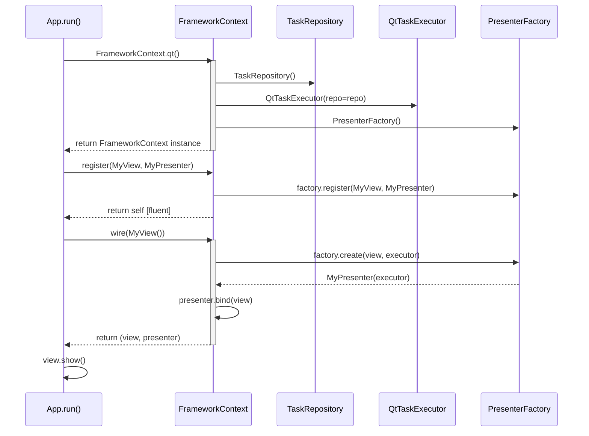
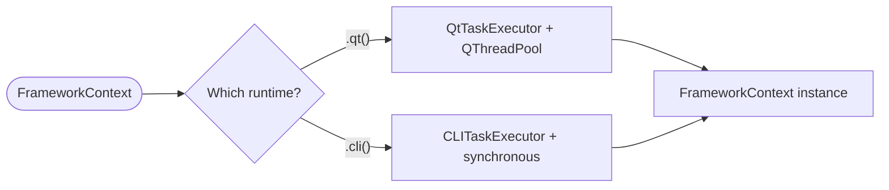
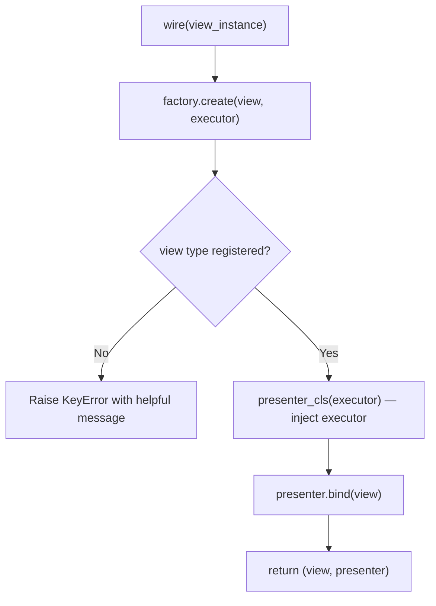
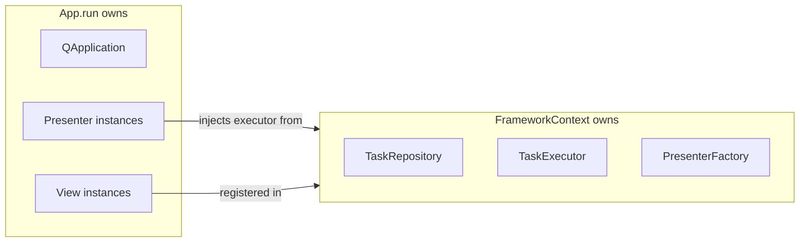

# SDD — Module `framework.bootstrap`

**Module:** `framework/bootstrap.py`
**Type:** Composition Root / DI Container
**Dependencies:** `framework.core`, `framework.runtime`, `framework.ui`

---

## 1. Responsibility

`FrameworkContext` is the **Single Point of Wiring** for the entire application. It creates and owns all shared services (`TaskExecutor`, `TaskRepository`, `PresenterFactory`) in one place, and provides a fluent API to register and wire Views with Presenters. No application code should ever manually instantiate these services.

---

## 2. Class Diagram



---

## 3. The 3-Step Composition Root Pattern

Every `App.run()` method follows exactly this ritual:

```python
# Step 1 — Bootstrap: one call, all services created
ctx = FrameworkContext.qt()

# Step 2 — Register: declare view → presenter mappings
ctx.register(MyView, MyPresenter)
# Chainable: ctx.register(ViewA, PresenterA).register(ViewB, PresenterB)

# Step 3 — Wire: instantiate view + create + bind presenter
view, _ = ctx.wire(MyView())
view.show()
```

---

## 4. Bootstrap Sequence



---

## 5. Runtime Factory Methods



| Method | Creates | Use case |
|---|---|---|
| `FrameworkContext.qt()` | `QtTaskExecutor` backed by `QThreadPool` | PySide6 GUI applications |
| `FrameworkContext.cli()` | `CLITaskExecutor` synchronous | Terminal scripts, headless testing |

**Extension pattern:** To add a new runtime, add a classmethod:
```python
@classmethod
def ws(cls) -> "FrameworkContext":
    from framework.runtime.ws_executor import WebSocketTaskExecutor
    repo = TaskRepository()
    return cls(executor=WebSocketTaskExecutor(repo=repo), repo=repo)
```

---

## 6. `wire()` Internal Flow



`wire()` is a convenience method that combines what would otherwise be three separate calls:
```python
# Manual equivalent of ctx.wire(view)
presenter = factory.create(view, executor)
presenter.bind(view)
view._set_presenter(presenter)   # handled inside bind()
```

---

## 7. Ownership & Lifetime Rules



**Rules:**
1. Create `FrameworkContext` **once** per application lifecycle, inside `App.run()`.
2. **Never** instantiate `TaskExecutor`, `TaskRepository`, or `PresenterFactory` outside of `FrameworkContext`.
3. `FrameworkContext` must be created **after** `QApplication` (Qt mode) since `QtTaskExecutor` uses `QThreadPool.globalInstance()` which requires an active `QApplication`.

---

## 8. Testing Notes

| Scenario | Test approach |
|---|---|
| `FrameworkContext.cli()` | Pure pytest — create, register, wire with MagicMock view |
| `FrameworkContext.qt()` | Requires `QApplication`; use `pytest-qt` |
| `register()` chain | Register multiple pairs; verify all in factory |
| `wire()` with unregistered view | Assert `KeyError` raised |
| `wire()` binds presenter | Assert `presenter.view is view` after `wire()` |
