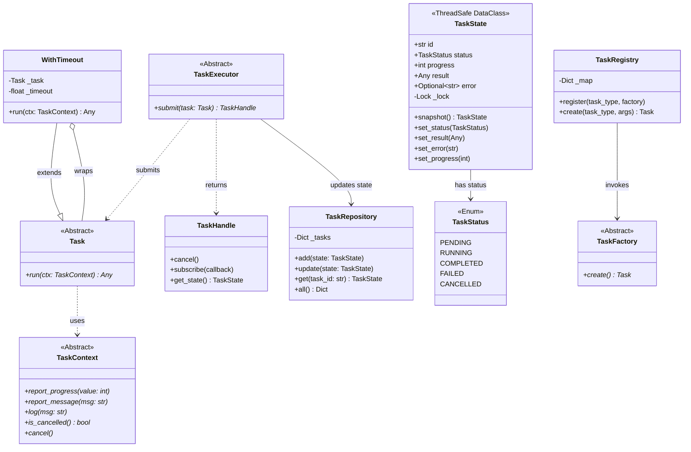
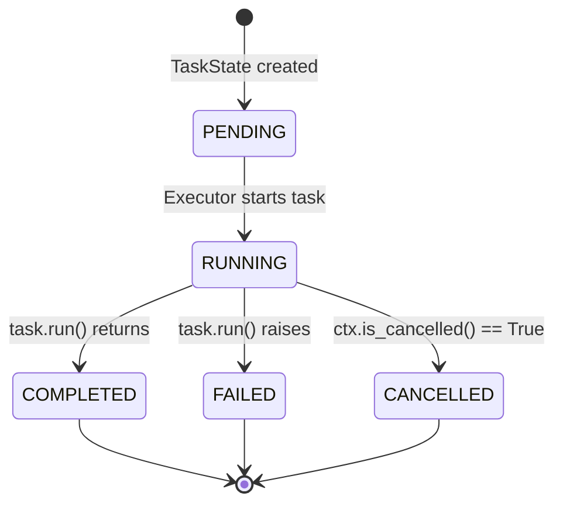
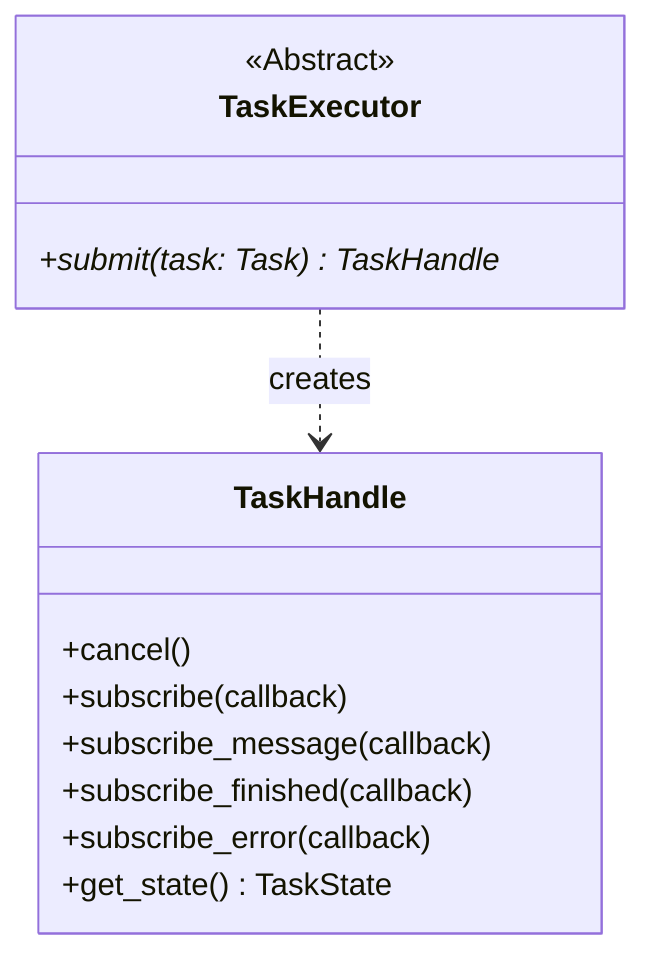
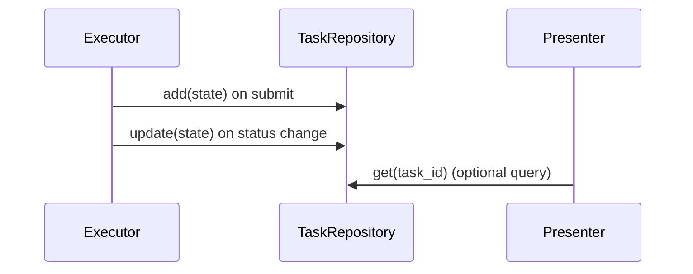
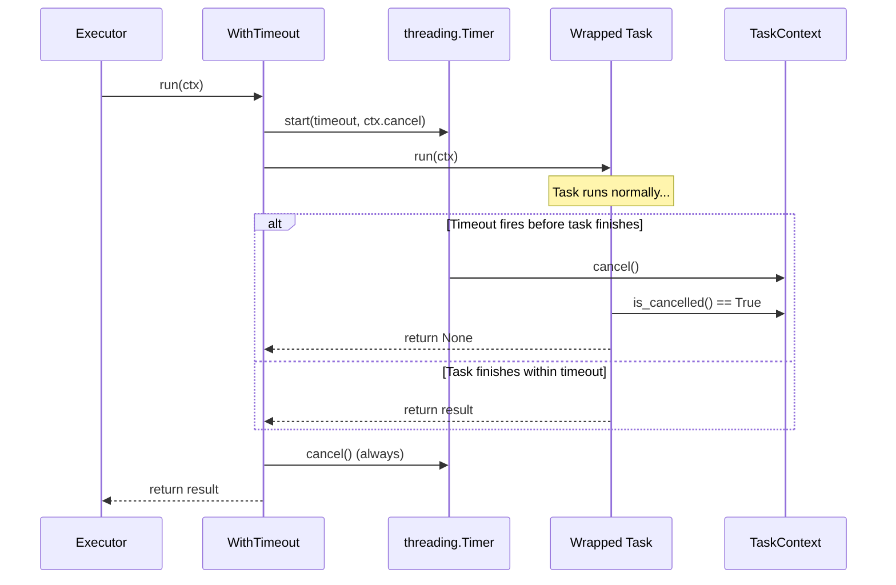
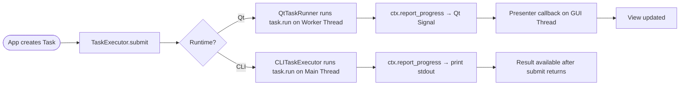

# SDD — Module `framework.core`

**Module:** `framework/core/`
**Type:** Pure Domain Layer
**Dependencies:** Python Standard Library only (no Qt, no PySide6)

---

## 1. Responsibility

This module is the **heart of the framework**. It defines the abstract contracts (interfaces) and data structures that the entire system depends on. The core must remain 100% pure Python — any file in this module that imports Qt is a defect.

---

## 2. Module Class Diagram



---

## 3. Component Specifications

### 3.1 `task.py` — `Task` ABC

**File:** `framework/core/task.py`

The root abstract class for all domain logic. A `Task` knows nothing about threads, Qt, or the UI.

```python
class Task(ABC):
    @abstractmethod
    def run(self, ctx: TaskContext) -> Any: ...
```

**Contract rules:**
- Must never import PySide6 or any UI library.
- Must call `ctx.is_cancelled()` at least once per loop iteration.
- Returns a value on success; raises on unrecoverable failure.
- Exceptions are caught by the Executor → `TaskState.status = FAILED`.

---

### 3.2 `task_context.py` — `TaskContext` ABC

**File:** `framework/core/task_context.py`

The communication port between a running Task and its hosting runtime. Tasks call these methods; the runtime adapters implement them.

| Method | Purpose | Notes |
|---|---|---|
| `report_progress(int)` | Progress 0–100 | Qt → Signal; CLI → print |
| `report_message(str)` | User-visible status | Qt → Signal; CLI → print |
| `log(str)` | Debug diagnostics | Routes to Python `logging`, NOT UI |
| `is_cancelled() → bool` | Check cancellation flag | Called in task loop |
| `cancel()` | Set cancellation flag | Called by `WithTimeout` or `TaskHandle` |

**Key design decision:** `log()` is explicitly separate from `report_message()`. Mixing them would flood the UI with debug noise. `log()` goes to Python's logging infrastructure (file, stderr) while `report_message()` goes to the status label visible to the end user.

---

### 3.3 `task_state.py` — `TaskState` & `TaskStatus`

**File:** `framework/core/task_state.py`

Thread-safe state object. Written by the Worker Thread, read by the GUI Thread.



**Thread-safety mechanism:**
- All mutations (`set_status`, `set_result`, `set_error`, `set_progress`) acquire `_lock` before writing.
- `snapshot()` acquires the lock and returns `copy.copy(self)` — a shallow copy safe to read from any thread.
- GUI Thread must ONLY read via `handle.get_state()` which calls `state.snapshot()`.

---

### 3.4 `task_executor.py` — `TaskExecutor` ABC + `TaskHandle`

**File:** `framework/core/task_executor.py`



`TaskHandle` is the returned token from `submit()`. The Presenter holds this handle to:
- Subscribe callbacks to signals (progress, finished, error).
- Cancel the task (`handle.cancel()`).
- Read the current state (`handle.get_state()`).

---

### 3.5 `task_repository.py` — `TaskRepository`

**File:** `framework/core/task_repository.py`

An in-memory dictionary store keyed by `TaskState.id`. It acts as the single source of truth for all submitted task states.



**Note:** In the current architecture, Presenters receive state updates via `TaskHandle` subscriptions (Signals). Direct `TaskRepository` queries are optional and intended for future features (e.g., task dashboards, audit logs).

---

### 3.6 `task_registry.py` — `TaskRegistry` + `TaskFactory`

**File:** `framework/core/task_registry.py`

A lookup table mapping task type keys to factory callables. Used when tasks need to be created dynamically by type name (e.g., from a configuration file or a command string).

```python
registry = TaskRegistry()
registry.register("scan", lambda **kw: FileScanTask(**kw))
task = registry.create("scan", directory="/tmp")
```

`TaskFactory` ABC provides a typed interface for object-based factories:

```python
class ScanTaskFactory(TaskFactory):
    def create(self) -> FileScanTask:
        return FileScanTask(directory="/tmp")
```

---

### 3.7 `task_timeout.py` — `WithTimeout`

**File:** `framework/core/task_timeout.py`

A Decorator-pattern `Task` that wraps any existing task and enforces a maximum execution time.



**Usage:**
```python
task = WithTimeout(HeavyTask(), timeout_sec=30.0)
handle = executor.submit(task)
```

The wrapped task is responsible for checking `ctx.is_cancelled()` and returning early — cooperative cancellation applies.

---

## 4. Data Flow Summary



---

## 5. Testing Notes

All components in `framework/core` are testable with **pure pytest** — no Qt required.

| Component | Test approach |
|---|---|
| `TaskState` | Direct mutation + `snapshot()` assertion |
| `TaskRepository` | Add/get/update with `TaskState` stubs |
| `WithTimeout` | CLITaskContext with cancellation check |
| `TaskRegistry` | Register factory lambda + create |
| `Task` subclass | Run with `CLITaskContext`, assert result |
