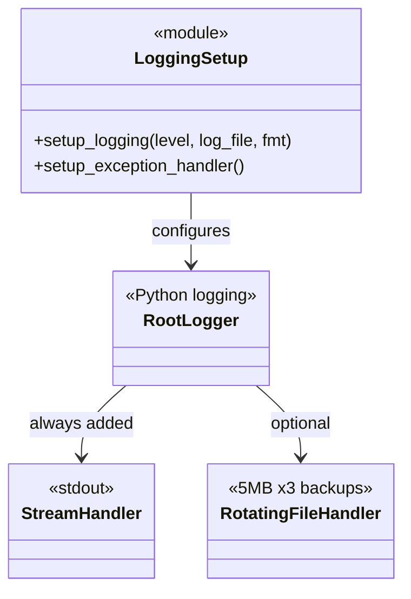
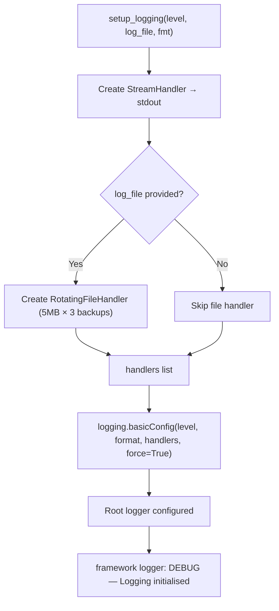
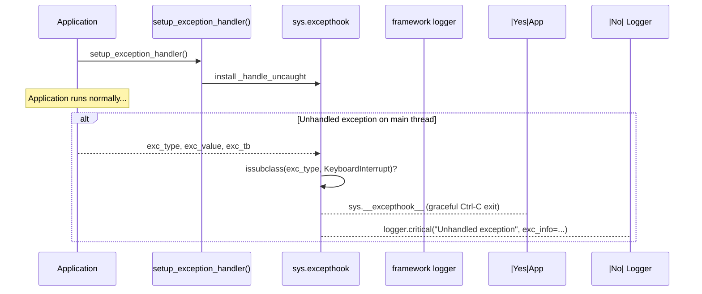
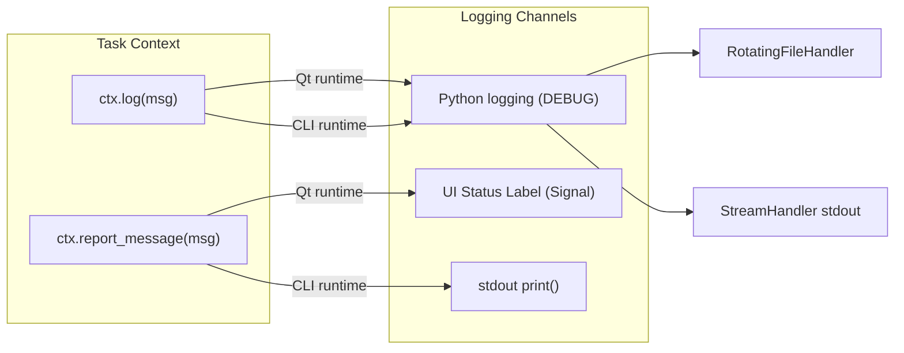

# SDD — Module `framework.logging_setup`

**Module:** `framework/logging_setup.py`
**Type:** Infrastructure / Cross-Cutting Concern
**Dependencies:** Python standard library (`logging`, `sys`)

---

## 1. Responsibility

Provides two startup functions that must be called **once** at application launch (inside `AppFactory.from_args()`) before any other component is created:

1. `setup_logging()` — configures the root Python logger.
2. `setup_exception_handler()` — installs a global `sys.excepthook` to catch and log unhandled exceptions.

---

## 2. Module Overview



---

## 3. `setup_logging()` Flow



**Parameters:**

| Parameter | Default | Purpose |
|---|---|---|
| `level` | `logging.INFO` | Minimum log level to capture |
| `log_file` | `None` | Optional path to rotating log file |
| `fmt` | `%(asctime)s [%(levelname)-8s] %(name)s: %(message)s` | Log record format |

**Rotating file handler settings:** `maxBytes=5MB`, `backupCount=3`, `encoding='utf-8'`. Old log files are automatically rotated when the size limit is reached.

---

## 4. `setup_exception_handler()` Flow



**Why this is needed:** Python's default `sys.excepthook` prints a traceback to stderr, but this output is lost when the application is running as a production service or when stdout/stderr are redirected. Installing a custom hook ensures all unhandled exceptions are captured in the log file.

**Keyboard interrupt exception:** `KeyboardInterrupt` is explicitly excluded from the custom handler and forwarded to Python's default hook. This ensures `Ctrl-C` exits cleanly without logging a spurious critical error.

---

## 5. Logging Architecture in the Framework



**Key separation principle:**
- `ctx.log()` → Python logging system → file + stream (developer diagnostics)
- `ctx.report_message()` → UI label or stdout (user-visible status)

These channels must NEVER be mixed. Logging to the message signal would flood the UI with debug noise; displaying user messages only in the log file would provide no user feedback.

---

## 6. Usage

```python
# In AppFactory.from_args() — before any other component:
from framework.logging_setup import setup_logging, setup_exception_handler

setup_logging(level=logging.DEBUG, log_file="app.log")
setup_exception_handler()
```

All subsequent `logging.getLogger(__name__)` calls in any framework or application module automatically inherit this configuration.

---

## 7. Testing Notes

| Scenario | Test approach |
|---|---|
| `setup_logging()` basics | Call with `level=DEBUG`; assert `logging.root.level == DEBUG` |
| Rotating file handler | Call with `log_file="test.log"`; assert file created |
| `setup_exception_handler()` | Call; assert `sys.excepthook` is the custom function |
| KeyboardInterrupt passthrough | Trigger hook with `KeyboardInterrupt`; assert default hook called |
| Unhandled exception logged | Trigger hook; assert `logger.critical` was invoked |
