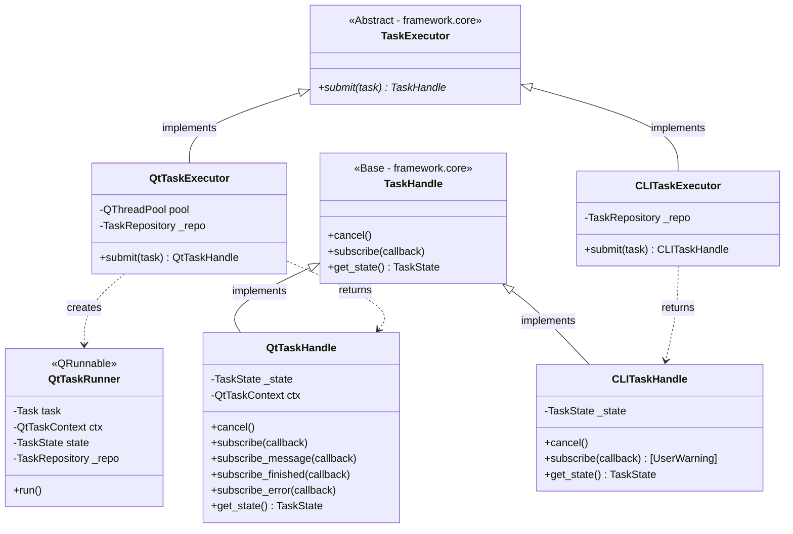
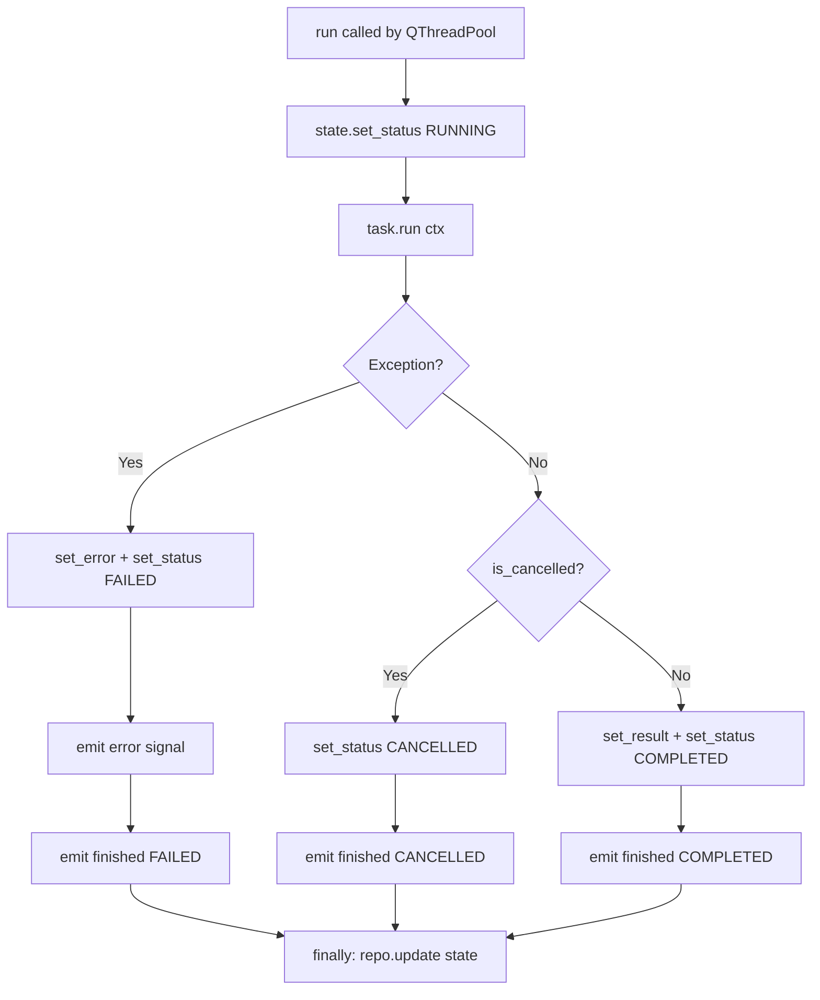

# SDD — Module `framework.runtime`

**Module:** `framework/runtime/`
**Files:** `qt_executor.py`, `cli_executor.py`
**Type:** Runtime Execution Layer
**Dependencies:** `framework.core`, `framework.adapters`, PySide6 (Qt only)

---

## 1. Responsibility

This module owns the **execution mechanism** for tasks. It decides how a Task gets scheduled (thread pool vs synchronous), manages the `TaskState` transitions, and returns a `TaskHandle` back to the caller (Presenter).

---

## 2. Module Class Diagram



---

## 3. Qt Runtime — `qt_executor.py`

### 3.1 Overall Flow

```mermaid
sequenceDiagram
    autonumber
    participant Presenter
    participant Executor as QtTaskExecutor
    participant Repo as TaskRepository
    participant Runner as QtTaskRunner (QRunnable)
    participant Pool as QThreadPool
    participant Task as Task.run() [Worker Thread]
    participant Ctx as QtTaskContext

    Presenter->>Executor: submit(task)
    Executor->>Ctx: new QtTaskContext()
    Executor->>Repo: state = TaskState(PENDING)
    Executor->>Repo: repo.add(state)
    Executor->>Runner: new QtTaskRunner(task, ctx, state, repo)
    Executor->>Pool: pool.start(runner)
    Executor-->>Presenter: return QtTaskHandle(state, ctx)

    note over Pool,Task: QThreadPool picks a free worker thread
    Pool->>Runner: run()
    Runner->>Repo: state.set_status(RUNNING); repo.update()
    Runner->>Task: task.run(ctx)

    alt Task completes normally
        Task-->>Runner: return result
        Runner->>Repo: state.set_result(result); set_status(COMPLETED)
        Runner->>Ctx: signals.finished.emit(COMPLETED)
    else Task raises Exception
        Runner->>Repo: state.set_error(exc); set_status(FAILED)
        Runner->>Ctx: signals.error.emit(str(exc))
        Runner->>Ctx: signals.finished.emit(FAILED)
    else Task cancelled
        Runner->>Repo: state.set_status(CANCELLED)
        Runner->>Ctx: signals.finished.emit(CANCELLED)
    end
    Runner->>Repo: repo.update(state) [finally block]
```

### 3.2 `QtTaskRunner` Internal Logic

`QtTaskRunner` is a `QRunnable` — it is Qt's unit of work submitted to the thread pool. It is a **fire-and-forget** object: once `pool.start(runner)` is called, Qt owns its lifecycle.



### 3.3 `QtTaskHandle`

Returned to the Presenter immediately after `submit()`. It is the Presenter's control panel for the task.

| Method | Action |
|---|---|
| `cancel()` | Calls `ctx.cancel()` → sets `_cancelled = True` |
| `subscribe(cb)` | Connects `cb` to `ctx.signals.progress` |
| `subscribe_message(cb)` | Connects `cb` to `ctx.signals.message` |
| `subscribe_finished(cb)` | Connects `cb` to `ctx.signals.finished` |
| `subscribe_error(cb)` | Connects `cb` to `ctx.signals.error` |
| `get_state()` | Returns `state.snapshot()` (thread-safe read) |

---

## 4. CLI Runtime — `cli_executor.py`

### 4.1 Overall Flow

```mermaid
sequenceDiagram
    participant Caller
    participant Executor as CLITaskExecutor
    participant Repo as TaskRepository
    participant Task as Task.run()
    participant Ctx as CLITaskContext

    Caller->>Executor: submit(task)
    Executor->>Ctx: new CLITaskContext()
    Executor->>Repo: state = TaskState(RUNNING)
    Executor->>Repo: repo.add(state)

    note over Executor,Task: Synchronous — blocks until done
    Executor->>Task: task.run(ctx)

    alt Success
        Task-->>Executor: return result
        Executor->>Repo: state.set_result(result); set_status(COMPLETED)
    else Cancelled
        Executor->>Repo: state.set_status(CANCELLED)
    else Exception
        Executor->>Repo: state.set_error(exc); set_status(FAILED)
    end

    Executor->>Repo: repo.update(state) [finally]
    Executor-->>Caller: return CLITaskHandle(state)
```

### 4.2 `CLITaskHandle` — Synchronous-Only Contract

Since CLI execution is synchronous, the handle is returned **after** the task has already finished. Subscribing to callbacks is meaningless (there are no async signals). The handle enforces this with a loud warning:

```python
def subscribe(self, callback) -> None:
    warnings.warn(
        "CLITaskHandle.subscribe() has no effect. "
        "CLI execution is synchronous — use get_state() after submit() instead.",
        stacklevel=2,
    )
```

**Correct CLI usage pattern:**
```python
executor = CLITaskExecutor()
handle = executor.submit(MyTask())   # blocks until done
state = handle.get_state()           # read result here
print(state.result)
```

---

## 5. Runtime Comparison

| Attribute | `QtTaskExecutor` | `CLITaskExecutor` |
|---|---|---|
| Thread model | `QThreadPool` (background thread) | Synchronous (calling thread) |
| Progress notification | Qt Signals (async) | `print()` to stdout |
| Cancellation | `ctx._cancelled` flag (cooperative) | `ctx._cancelled` flag |
| Task state updates | Async via `repo.update()` in `QtTaskRunner` | Sync in `submit()` body |
| `subscribe()` | Functional — connects Qt Signal | Raises `UserWarning` |
| `get_state()` | Returns live snapshot | Returns final state |

---

## 6. Testing Notes

| Component | Test approach |
|---|---|
| `CLITaskExecutor.submit()` | Pure pytest — submit stub task, assert `handle.get_state().status` |
| `CLITaskHandle.subscribe()` | Assert `UserWarning` is raised |
| `QtTaskExecutor.submit()` | Requires `pytest-qt` (`qtbot`) |
| `QtTaskRunner.run()` | Unit test with mock `repo` and `CLITaskContext` substitute |
