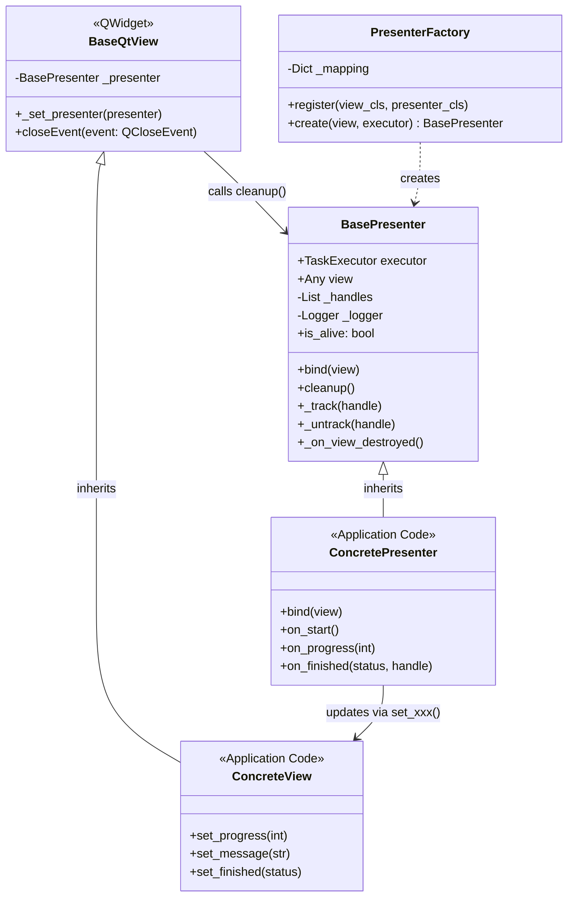
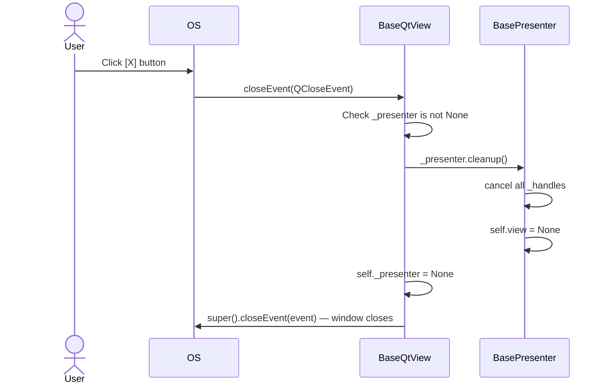
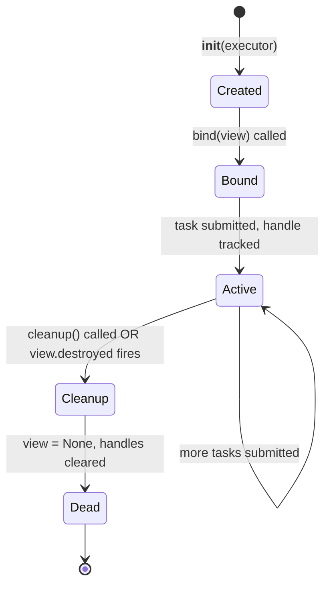
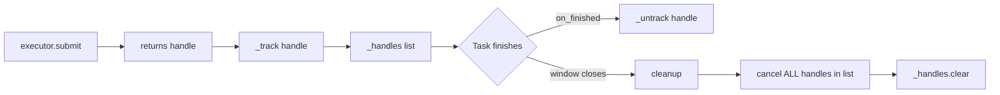
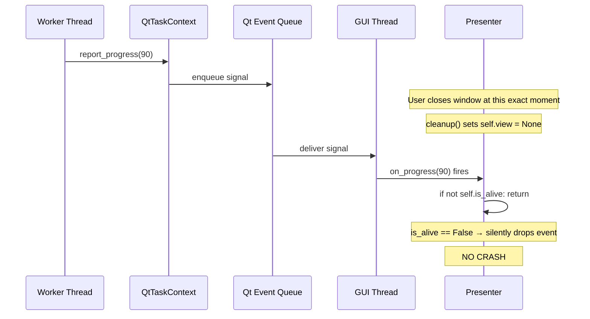
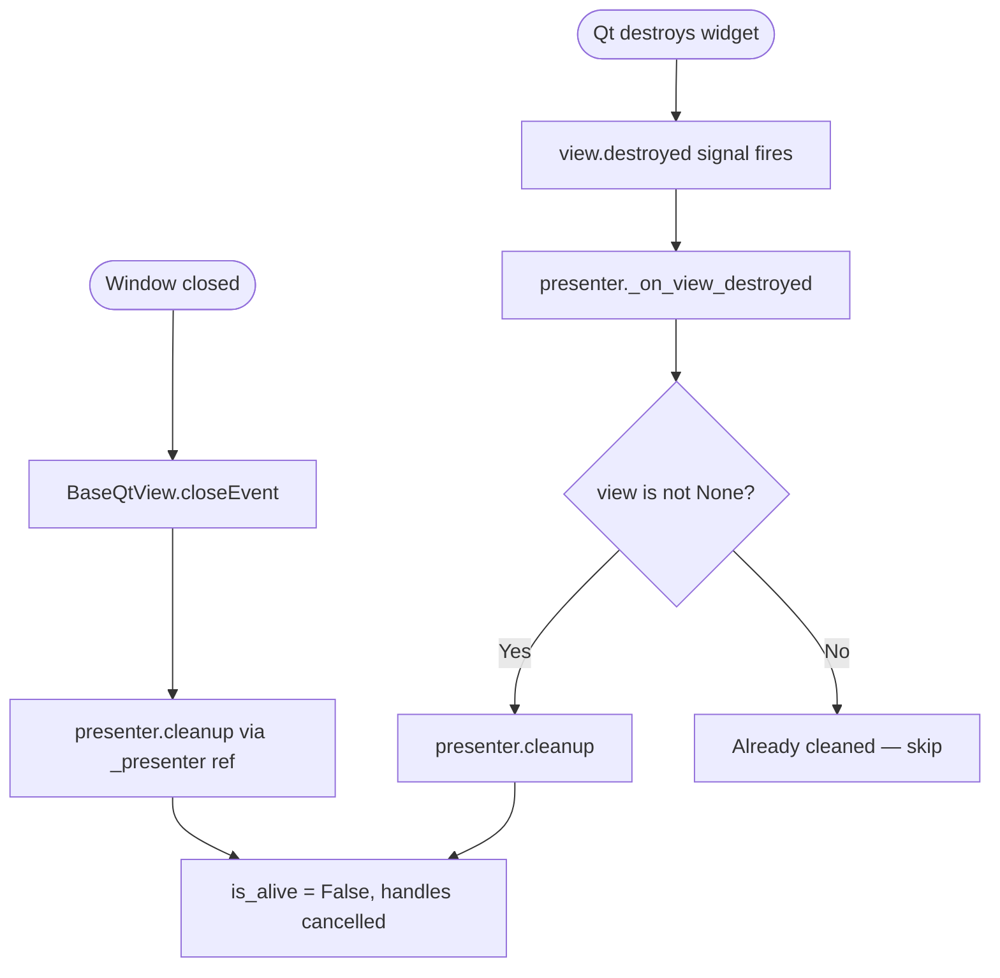
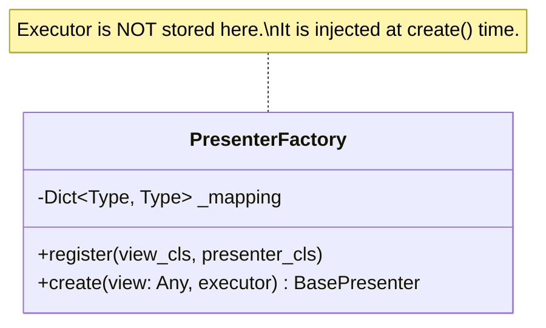
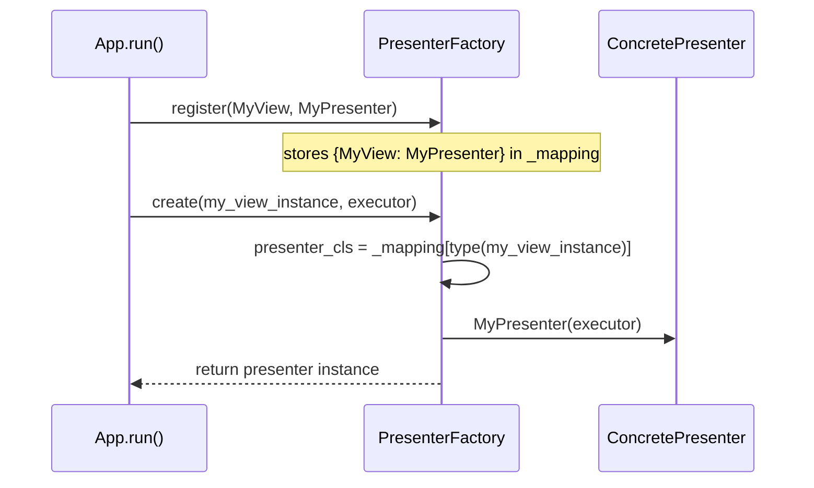
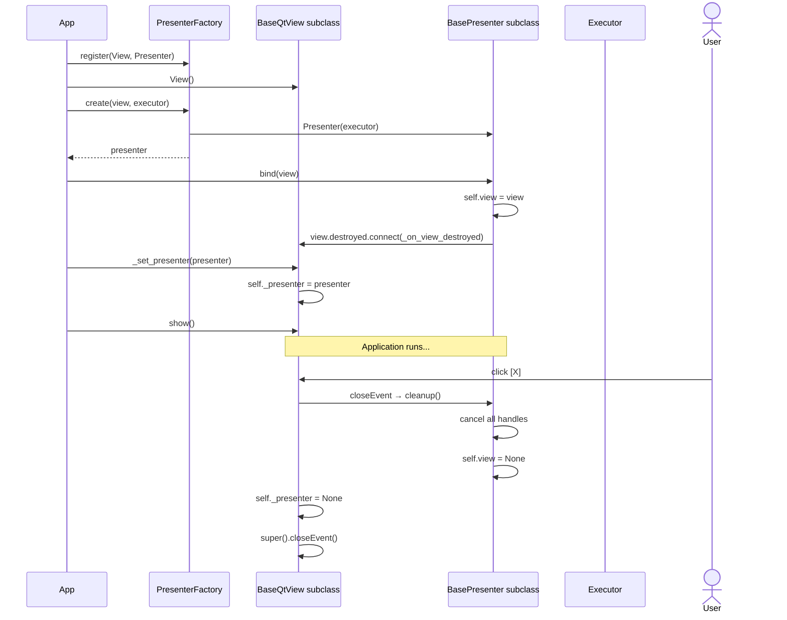

# SDD — Module `framework.ui`

**Module:** `framework/ui/`
**Sub-modules:** `ui/views/`, `ui/presenters/`
**Type:** UI Contract Layer
**Dependencies:** `framework.core`, PySide6 (`BaseQtView` only)

---

## 1. Responsibility

This module defines the **mandatory base classes** for all application Views and Presenters. It enforces the lifecycle contract that prevents zombie tasks and `NoneType` crashes. Application code inherits from these classes — it never imports PySide6's `QWidget` directly.

---

## 2. Module Class Diagram



---

## 3. Component Specifications

### 3.1 `views/base_qt_view.py` — `BaseQtView`

**File:** `framework/ui/views/base_qt_view.py`

The foundational `QWidget` subclass that every application view must inherit. Its sole added behavior is the `closeEvent` override.



**Contract:**
- Every application view MUST inherit `BaseQtView`, not `QWidget`.
- After `PresenterFactory.create()`, call `view._set_presenter(presenter)` to wire the lifecycle.

**What happens WITHOUT `BaseQtView`:**
If a view inherits raw `QWidget` and the user closes the window while a background task runs, the `QWidget` is destroyed. The background thread later emits a signal, the connected slot fires, tries to access `self.view.set_progress()`, and crashes with `RuntimeError: Internal C++ object (QProgressBar) already deleted`.

---

### 3.2 `presenters/base_presenter.py` — `BasePresenter`

**File:** `framework/ui/presenters/base_presenter.py`

The foundation for all presenters. Manages the Task lifecycle (handle tracking), thread safety (`is_alive`), and cleanup.

#### 3.2.1 Lifecycle State Machine



#### 3.2.2 Handle Tracking



Every `TaskHandle` returned from `executor.submit()` MUST be passed to `self._track(handle)`. Failure to track a handle means `cleanup()` cannot cancel it — the task becomes a zombie.

#### 3.2.3 The `is_alive` Guard



`is_alive` is a property that returns `self.view is not None`. After `cleanup()` sets `self.view = None`, any late-arriving signal hits the guard and returns silently.

**Rule:** Every presenter callback that touches `self.view` MUST begin with:
```python
def on_progress(self, value: int) -> None:
    if not self.is_alive:
        return
    self.view.set_progress(value)
```

#### 3.2.4 Dual Cleanup Safety Net



`cleanup()` is **idempotent** — calling it twice is safe. The second call finds `_handles` already empty and `self.view` already `None`, and returns immediately.

---

### 3.3 `presenters/presenter_factory.py` — `PresenterFactory`

**File:** `framework/ui/presenters/presenter_factory.py`

A stateless registry mapping view classes to presenter classes. The executor is NOT stored in the factory — it is injected at `create()` time. This decouples the registration phase from the runtime execution phase.





**Error case:** If `create()` is called with a view type that was not registered, a clear `KeyError` is raised with the view class name and a hint to call `register()`.

---

## 4. Full Lifecycle: Startup to Cleanup



---

## 5. Testing Notes

| Component | Test approach |
|---|---|
| `BasePresenter.bind()` | Pass `MagicMock` view; assert `self.view` set |
| `BasePresenter.cleanup()` | Call cleanup; assert `is_alive == False`, handles cancelled |
| `BasePresenter._track/_untrack` | Track stub handle; assert list size |
| `BasePresenter.is_alive` guard | Set `view = None`; call callback; assert no AttributeError |
| `PresenterFactory.create()` | Register pair; call create; assert returned type |
| `PresenterFactory.create() KeyError` | Unregistered view; assert `KeyError` raised |
| `BaseQtView.closeEvent` | Requires `pytest-qt`; verify `cleanup()` called |
